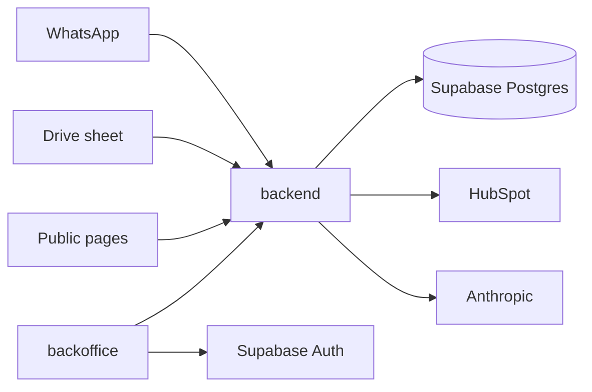
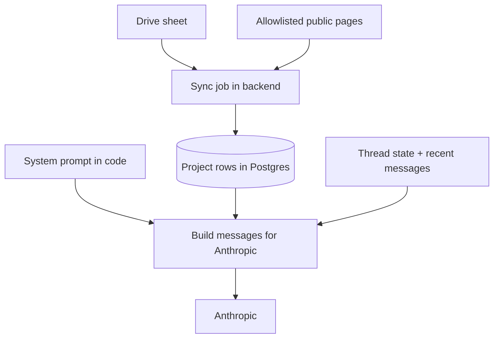

# Design — Altamira Uruguay WhatsApp assistant (v1)

Internal design for Luis. The commercial contract is still the HTML proposal. This file is how we build it.

**Status:** design only. No application code until kickoff after they accept the proposal.

## Goal

Qualify WhatsApp leads for Altamira Uruguay, answer the questions that repeat, and hand a clean summary to a human advisor in HubSpot. The assistant does not book visits, does not quote future rental yields, and does not replace the sales team.

Volume they reported: about 15–20 leads/day and ~60 conversations/day. About 70% write outside office hours.

## Repo layout

One repo, two apps. No Turborepo.

```
backend/      TypeScript HTTP service (Express). WhatsApp webhook, conversation, HubSpot, knowledge sync.
backoffice/   Next.js (client-side), shadcn, Tailwind, React Query. Thread list and pause.
docs/         Proposal, meeting notes, this design.
```

The backoffice calls the backend over HTTP. It does not talk to Postgres. Shared types can live in a small `shared/` folder later if duplication becomes painful; do not add that on day one.

## Stack

| Layer | Choice | Why |
| --- | --- | --- |
| Language | TypeScript | Same language in both apps. |
| Backend | Express on Node | Familiar HTTP server; always-on process for the webhook. |
| Backoffice | Next.js + shadcn + Tailwind + React Query, client-first | UI and routing only. No SSR requirement: pages are client components, data via React Query against the backend. |
| Database | Supabase Postgres | Managed Postgres. |
| ORM | Prisma | Schema and all queries from the backend. Use the Supabase Postgres connection string; use the direct URL for migrations. |
| Auth | Supabase Auth (browser client in the backoffice) | Email login for a few operators. The backoffice sends the Supabase JWT to the backend; the backend verifies it. The browser never gets the database password. |
| LLM | Anthropic (current small model) | Already agreed with Altamira; they pay the key. One `complete()` wrapper so a later OpenAI swap is one file. No fine-tune. No multi-provider framework. |
| WhatsApp | Meta Cloud API | Official marketing/API number. |
| CRM | HubSpot Sales Pro API | Direct upsert. No Zapier / Make / n8n. No HubSpot native AI. |
| Knowledge | Google Drive sheet + allowlisted public pages | Sheet for commercial facts. Site for stable facts only. Injected into the prompt at reply time. |

## Architecture



1. Meta posts an inbound message to the backend webhook.
2. The backend loads or creates the thread, ignores duplicates by WhatsApp message id, and runs the conversation rules.
3. When a reply is needed, the backend loads project rows from Postgres, builds the system prompt + knowledge block + recent messages, and calls Anthropic.
4. On handoff or close, the backend upserts HubSpot and writes the transcript.
5. Operators open the backoffice in the browser, sign in with Supabase Auth, and call the backend (with the JWT) to list threads or pause one.

## Knowledge

No RAG. No embeddings. No live website browsing during a chat. Facts are synced into Postgres ahead of time, then pasted into the LLM prompt when the bot answers.

### How facts reach the chatbot



Three pieces, kept separate on purpose:

1. **System prompt (in code)** — tone, the three questions, what not to say (no rental yield, no invented inventory), when to hand off. Edited by Luis when behavior needs tuning. Not stored in Drive.
2. **Drive sheet → `Project` rows** — commercial facts Altamira updates. Sync job (manual from the backoffice, and on a schedule) reads the sheet via a Google service account and upserts rows: name/slug, price-from, typologies, delivery date, orientation, short notes. Full inventory stays out of chat.
3. **Allowlisted public pages → `siteNotes` on each project** — stable facts only (address, amenities, neighborhood). A scheduled fetch strips the HTML to plain text and stores it. The bot does not open URLs while chatting.

At reply time the backend:

1. Loads the relevant `Project` rows from Postgres.
2. Formats them into a short **knowledge block** (structured text, not a vector search).
3. Sends to Anthropic: system prompt + knowledge block + conversation turns.
4. The model answers only from that. If a fact is not in the block, it must say it does not know and hand off.

v1 does **not** ingest extra PDFs, FAQs, or random tools into the bot. If Altamira later wants another document type, add a sync path into the same `Project` (or a small `KnowledgeDoc`) table and include it in the knowledge block. Still no RAG unless volume of text forces it.

Conflict rules:

1. Price, typology, delivery, orientation, and availability → the sheet wins over `siteNotes`.
2. If a fact is missing from both → the bot says it does not know and hands off.
3. Never invent rental yield or guaranteed returns.
4. Never crawl or fetch a URL while answering a lead.

## Conversation

Rules own the flow. The model writes the Spanish reply.

States (stored on the thread):

1. **Greeting** — welcome, then move into the three questions.
2. **Qualify** — interest, budget, whether they know the projects.
3. **Answer** — reply to repeated questions from the project fields. Stay here while they ask.
4. **Handoff** — ask when an advisor can call, then stop the bot for that case.
5. **Closed** — no interest; do not assign an advisor.
6. **Paused** — a human took over from the backoffice. Store inbound messages; do not reply.

Other rules:

- Inbound text is stored as-is.
- A non-text message (voice, image, sticker) gets one reply asking the lead to type. No transcription in v1.
- Meta webhook retries are ignored by WhatsApp `message.id` uniqueness.
- A lead who writes on the API number gets the greeting. A lead who arrives from a form gets one approved welcome template, then the same flow. Meta fees for that send stay with Altamira.
- Advisors keep their own personal WhatsApp numbers. The bot never lives on those phones.

## HubSpot

On handoff or close:

1. Upsert the contact by phone.
2. Write a long text property with: interest, budget, whether they know the projects, agreed call time (if any), and the full transcript.
3. Do not use HubSpot’s native AI module.

Exact property names are confirmed at kickoff once Luis has HubSpot access.

## Data model (Prisma sketch)

Names can move when the schema is created. Intent:

- **Project** — sheet fields + `siteNotes` + `syncedAt`.
- **Thread** — WhatsApp phone, state, paused flag, HubSpot contact id, call time, created/updated.
- **Message** — thread id, direction (`in` / `out`), body, WhatsApp message id (unique, nullable for outbound until sent), createdAt.
- **Operator** — optional local mirror of Supabase Auth users if needed for audit; otherwise Auth alone is enough for v1.

## Backend surface

Rough routes (names can change):

- `GET/POST /webhooks/whatsapp` — Meta verification and inbound events.
- `POST /internal/knowledge/sync` — pull the Drive sheet (and optionally site notes). Protected.
- `GET /internal/threads` — list threads for the backoffice.
- `GET /internal/threads/:id` — thread + messages.
- `POST /internal/threads/:id/pause` and `.../resume`.

Auth: Meta signature on the webhook. Supabase JWT on `/internal/*`.

LLM: one module, e.g. `backend/src/llm/complete.ts`, that takes system + messages and returns text. Prompt templates live next to the conversation rules, not inside the model call.

## Backoffice (v1)

Client-side Next.js. Use the App Router for file-based routing and shadcn setup, but do not rely on SSR or Server Components for data. Pages are client components; React Query talks to the Express backend. Supabase Auth runs in the browser (`@supabase/supabase-js`); the access token is sent as `Authorization: Bearer …` on backend calls.

Pages:

1. Login (Supabase email).
2. Thread list (newest activity first). Show phone, state, paused, last message preview.
3. Thread detail — full messages, pause / resume.
4. Knowledge — button to trigger a sheet sync; show last sync time.

React Query with polling (for example every 10–15 seconds on the list) is enough at this volume. No realtime subscription required in v1.

Visual style can follow Altamira’s teal / cream later; shadcn defaults are fine to ship first.

## Hosting and secrets

- **Backoffice:** Vercel.
- **Backend:** always-on Node process (Fly.io, Railway, or similar). The WhatsApp webhook must not be a short-lived serverless function that times out mid-LLM call.
- **Secrets (env only, never committed):** Meta app credentials, Anthropic API key (Altamira’s account), HubSpot private app token, Google service account for Drive, Supabase URL + anon + service role as needed, Prisma `DATABASE_URL` and direct URL, webhook verify token.

## Out of scope (v1)

Instagram DM, Messenger, email-to-WhatsApp, landing-form automation beyond the one welcome template, mass email / remarketing, Costa Rica (“Erika”), Calendly, native HubSpot AI, a second country, selling this as a product to other developers, voice-note transcription, sending the project PDF presentation, and anything billed as a future version.

## Build order

1. Repo skeleton: `backend/` and `backoffice/`, Prisma + Supabase Auth, empty deploy.
2. Drive sheet sync into `Project` rows; manual sync from the backoffice.
3. WhatsApp webhook: store messages, greeting, three questions.
4. Answer path with Anthropic + sheet fields + yield / invent guardrails.
5. Handoff / close → HubSpot upsert + transcript.
6. Backoffice thread list, detail, pause / resume.
7. Form-lead welcome template.
8. Scheduled allowlisted site notes into `siteNotes`.
9. Live prompt tuning after go-live (ongoing; not a setup checkbox).

## Open at kickoff

- Exact Drive sheet columns and who fills the template.
- HubSpot custom property name for the transcript.
- WhatsApp number and Meta Business access.
- Allowlist of public URLs for site notes.
- Hosting account for the always-on backend.
