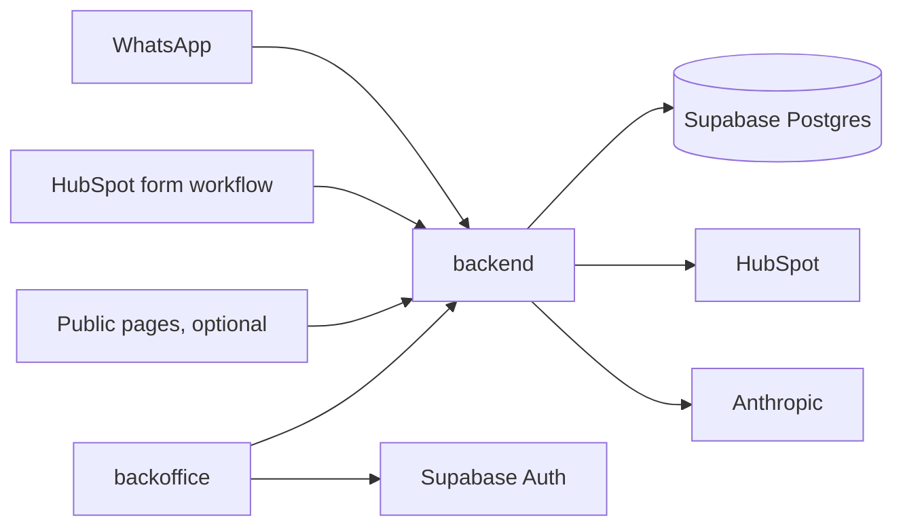
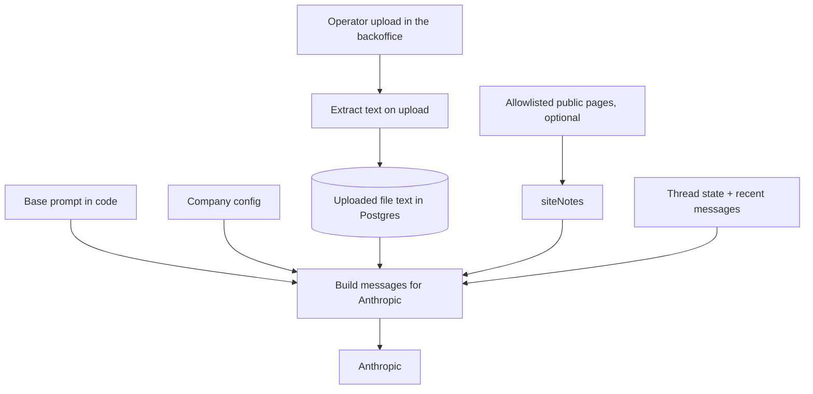

# Design — WhatsApp lead assistant (v1, first client: Altamira Uruguay)

Internal design for Luis. The commercial contract with Altamira is the HTML proposal. This file is how we build it.

**Status:** Altamira accepted. Kickoff is on and the v1 build exists (backend, backoffice, tests, Docker image, CI). Live HubSpot, production WhatsApp, and their Anthropic key are still week-1 access; until then a company with no key for an integration runs on an in-process fake (development only). v1 knowledge is files operators upload in the backoffice. Google Drive / Sheets sync is later.

## Goal

Qualify WhatsApp leads, answer the questions that repeat, and hand a clean summary to a human advisor in the CRM. The assistant does not book visits, does not quote future rental yields, and does not replace the sales team.

Altamira Uruguay is the first client. Volume they reported: about 15–20 leads/day and ~60 conversations/day. About 70% write outside office hours.

**Product goal:** the same system should later be sold to other companies with the same problem (real-estate developers first). Version 1 ships only what Altamira needs, but the code is built as a multi-company product from day one. See [Multi-company](#multi-company).

## Repo layout

One repo, two apps. No Turborepo.

```
backend/      TypeScript HTTP service (Express). WhatsApp webhook, conversation engine, CRM, knowledge uploads.
backoffice/   Next.js (client-side), shadcn (preset b1Z5bafVA), Tailwind, React Query. Threads, pause, knowledge files.
docs/         Proposal, meeting notes, this design.
docker-compose.yml   Local Postgres (plus a test database).
```

The backoffice calls the backend over HTTP. It does not talk to Postgres. Shared types can live in a small `shared/` folder later if duplication becomes painful; do not add that on day one.

Backend source layout:

```
backend/src/
  features/<resource>/        one controller + one service per endpoint, plus a routes file per resource
                              (threads, knowledge, me, whatsapp-webhook, form-leads). Services call Prisma directly.
  engine/                     pure: turn decisions (states, qualify gate), prompt building, history, guardrails
  conversation/               the pipeline: record inbound, reply scheduler, one bot turn, CRM sync, sweeper, lease
  integrations/
    whatsapp/                 Meta Cloud API: webhook parsing, signature, send text/template, fake channel
    crm/                      Crm interface, HubSpot adapter, fake CRM
    knowledge/                text extraction from uploaded files
    registry.ts               picks the real adapter or the fake per company
  llm/                        complete() around Anthropic (tool use), and the local fake
  companies/                  company config schema, encrypted secrets, loading a company
  http/                       operator auth, input validation, error handler
  lib/                        env-free helpers: Prisma client, logger, crypto, phone numbers
backend/prisma/               schema, migrations, development seed (Altamira's config lives in seed-data/)
backend/scripts/              terminal chat, signed test webhook, set a company secret, add an operator
```

The engine never imports HubSpot, Google, or Meta directly. It talks to small interfaces (`Crm`, `Channel`, `LlmClient`). Adding a second CRM means a new adapter folder, not a rewrite.

## Stack

| Layer | Choice | Why |
| --- | --- | --- |
| Language | TypeScript | Same language in both apps. |
| Backend | Express 5 on Node 22, deployed as a Docker image | Familiar HTTP server. A small always-on container so the webhook and LLM call are not cut off. The container applies migrations on start. |
| Backoffice | Next.js 16 + shadcn (preset `b1Z5bafVA`: base-vega style on Base UI, blue theme) + Tailwind 4 + React Query, client-first | UI and routing only. Pages are client components, data via React Query against the backend. Cache Components are off. Layout from the shadcn `dashboard-01` block. |
| Database | Supabase Postgres | Managed Postgres. |
| ORM | Prisma 7 with the `pg` driver adapter | Schema and all queries from the backend. Runtime uses the Supabase pooled connection; migrations use the direct connection (`prisma.config.ts`). |
| Auth | Supabase Auth (browser client in the backoffice) | Email login for operators. Public signup off; Luis creates accounts. The backoffice sends the Supabase JWT to the backend; the backend verifies it and resolves the operator’s company. |
| LLM | Anthropic (`claude-haiku-4-5` to start) | Already agreed with Altamira. Each company uses its own API key. One `complete()` wrapper so a later provider swap is one file. No fine-tune. No multi-provider framework. |
| WhatsApp | Meta Cloud API | Official API number per company. |
| CRM | HubSpot API (first adapter) | Direct API. No Zapier / Make / n8n. No HubSpot native AI. |
| Knowledge | Files operators upload in the backoffice | PDF, Word (DOCX, DOC), Excel (XLSX, XLS), OpenDocument (ODT, ODS), PowerPoint (PPTX), CSV/TSV, plain text, Markdown, HTML, JSON. Text is extracted on upload, stored per company, and injected into the prompt. No RAG. Google Drive / Sheets is later. |

## Architecture



1. Meta posts an inbound message to the backend webhook. The backend finds the company from the WhatsApp `phone_number_id`, stores the message, and returns 200 right away.
2. Processing happens after the response. Messages for one thread are handled one at a time, and a short wait (a few seconds) groups messages a lead sends in a row into one reply.
3. When a reply is needed, the engine loads the company config and the extracted text of that company’s uploaded files, builds the system prompt + knowledge block + recent messages, and calls Anthropic.
4. The model returns structured output: the reply text plus any extracted fields (see [Conversation](#conversation)). The engine updates the thread state from those fields, runs the guardrails, then sends the reply.
5. On handoff or close, the engine upserts the CRM contact and writes the transcript.
6. Operators open the backoffice, sign in with Supabase Auth, and call the backend (with the JWT) to list their company’s threads, pause one, or upload, replace, and delete knowledge files.

## Multi-company

### Deployment model

One shared deployment for all companies. Every company-owned row has a `companyId`. Every query filters by it.

- With only Altamira, this behaves like a single-client build.
- A new client is a new `Company` row, its config, its secrets, and its WhatsApp number pointed at the same webhook. No new server or database.
- Fallback: if a client ever requires its own isolated database, deploy the same Docker image a second time with its own environment. Same code, no fork.

### What lives in company config (not in code)

- Display name and brand voice notes.
- Language and tone (for Altamira: Uruguayan Spanish with “vos”).
- The qualifying questions.
- Forbidden topics (for Altamira: future rental yield, guaranteed returns).
- Knowledge limits (`knowledge.*`): 60,000 characters of extracted text per file, 150,000 per company (about 40k tokens of prompt), and 15 MB per original upload. Brochure PDFs are large because of their images, so the upload cap is generous and the text caps do the real work.
- CRM adapter type and property names.
- WhatsApp phone number id and template names.
- Business hours, used when offering a call time.

### Secrets per company

Anthropic key, HubSpot token, and Meta access token are per company. They are encrypted on the Company row with AES-256-GCM. The encryption key lives only in the server environment. Platform secrets (database URLs, encryption key, Supabase URL and keys, Meta app secret, webhook verify token) stay in environment variables. No Vault in v1. Google access is not a v1 secret. Drive / Sheets sync and a Connect Google OAuth flow are later. MCP is not the plan.

### Not in v1

Self-signup, billing, a company admin screen, and onboarding wizards. Luis sets up each new company by hand (seed script or SQL).

## Knowledge

No RAG. No embeddings. No live website browsing during a chat. The v1 source is files operators upload in the backoffice, per company. Text is extracted on upload, stored in Postgres, and pasted into the LLM prompt when the bot answers.

Supported formats: PDF, Word (DOCX, DOC), Excel (XLSX, XLSM, XLS), OpenDocument (ODT, ODS), PowerPoint (PPTX), CSV/TSV, plain text, Markdown, HTML, and JSON. Spreadsheets become one CSV block per sheet. Plain-text files saved as Windows-1252 or UTF-16 (common from Excel and Notepad) are decoded correctly.

Extracted text is capped so it fits the prompt. The defaults live on the company config: **60,000 characters per file** (`knowledge.maxCharsPerFile`), **150,000 per company** (`knowledge.maxCharsTotal`), and **15 MB per upload** (`knowledge.maxFileBytes`). An upload over a cap is rejected with a message that says by how much; it is never silently truncated, because a cut could drop a price.

Uploads are checked before parsing: the extension must be supported and the first bytes must match it. A PDF with no text layer (a scan) is rejected and the operator is told to upload a version with text. Only the extracted text and metadata are stored, not the original file. Uploading a file with the same name (any case) replaces it; "Reemplazar" on a row swaps a file for one with another name. Operators can preview the extracted text, so a badly exported file is caught before the bot quotes from it.

Allowlisted public pages (`siteNotes`) are not built in the MVP; uploads cover the same facts. They stay optional for later.

### How facts reach the chatbot



Four pieces, kept separate on purpose:

1. **Base prompt (in code)** — generic behavior shared by every company: answer only from the knowledge block, one question at a time, hand off when unsure, return the structured fields. Edited by Luis.
2. **Company config** — the company-specific parts filled into that prompt: name, tone, questions, forbidden topics.
3. **Uploaded files** — the commercial source. Price-from, typology, delivery, and orientation come from the extracted text. Re-uploading a file replaces its previous version. If the operator does not re-upload, prices go stale. Full inventory and unit-level availability stay with the advisor and are not dumped in chat.
4. **Allowlisted public pages → `siteNotes`** — optional and secondary. Stable facts only (address, amenities, neighborhood). A scheduled fetch can strip the HTML to plain text. Skip it when no allowlist is set. The bot does not open URLs while chatting.

At reply time the backend:

1. Loads the extracted text of that company’s uploaded files, plus site notes when they exist.
2. Formats them into a short **knowledge block** (structured text, not a vector search).
3. Sends to Anthropic: system prompt (base + company config + knowledge block, cached) and the conversation turns.
4. The model answers only from that. If a fact is not in the block, it says it does not know and offers the advisor.

Google Drive / Sheets sync, and a Connect Google OAuth flow, are later. MCP is not the plan. Still no RAG.

Conflict rules:

1. Price, typology, delivery, orientation, and availability → the uploaded files win over `siteNotes`.
2. If a fact is missing from both → the bot says it does not know and offers the advisor.
3. Never answer a forbidden topic (for Altamira: future rental yield or guaranteed returns).
4. Never crawl or fetch a URL while answering a lead.

## Conversation

The model writes the reply and extracts data. The engine owns the state.

### Structured output

Every model call returns, through Anthropic tool use:

- `reply` — the text to send.
- `interest`, `budget`, `knowsProjects` — filled when the lead says them.
- `callTime` — when the lead agrees to a call.
- `intent` — one of `continue`, `qualified`, `not_interested`, `needs_human`.

The engine moves the state from those fields. The model never sets the state directly. `qualified` is accepted but moves nothing on its own: the stored answers are the gate.

The system prompt has two blocks. The first (base rules, company config, all knowledge documents) is identical across turns, so it carries Anthropic's cache breakpoint. The second is per turn: the lead's local time, business hours, what is already known, and the next step the engine wants (for example, "ask the next missing question: …"). History is the last 40 messages. The call has a 25-second timeout; an invalid tool call is retried once before it counts as a model failure.

### States

1. **Greeting** — welcome, then move into the questions.
2. **Qualify** — ask the company’s questions (Altamira: interest, budget, whether they know the projects).
3. **Answer** — reply to repeated questions from the knowledge block. Stay here while they ask.
4. **Handoff** — ask when an advisor can call. Once a call time is captured, write the CRM and stop replying.
5. **Closed** — no interest; write the CRM, do not assign an advisor.

**Paused** is a separate flag, not a state. A human pauses the thread from the backoffice; inbound messages are stored but not answered. Resume returns to the state it had.

### Rules

- Inbound text is stored as-is.
- A non-text message (voice, image, sticker) gets one reply asking the lead to type. No transcription in v1.
- Duplicate webhook deliveries are ignored by WhatsApp `message.id` uniqueness.
- A lead who writes on the API number gets the greeting.
- A lead who fills a form gets one approved welcome template, then the same flow. A HubSpot workflow calls `POST /hooks/crm/form-lead` with the contact’s phone; the backend sends the template. The company pays Meta for that send.
- WhatsApp only allows free-form replies within 24 hours of the lead’s last message. Outside that window, only approved templates can be sent. v1 does not send follow-ups after that window.
- Leave **Qualify** only after `interest`, `budget`, and `knowsProjects` are stored. `knowsProjects` may be false. There is no numeric budget minimum in code. `intent` `not_interested` closes the thread even if a question is still open. `intent` `qualified` without the three stored answers does not leave Qualify.
- Once the three answers are stored the thread is in **Handoff** and the bot asks for a call time. The turn that stores the call time (with the three answers) writes the CRM, once.
- A lead who writes again after **Closed** or **Handoff** reopens the same thread in **Answer**. The thread keeps its history. If that same turn is the one that first completes the three answers and `callTime`, it still finishes the handoff and writes the CRM. A later message does not write the CRM again.
- A new answer replaces the stored one (a lead may correct their budget); an empty field never erases one.
- Messages that arrive while the thread is paused or waiting for a person are stored and marked handled. Resuming does not make the bot answer them; it answers from the next message.
- Advisors keep their own personal WhatsApp numbers. The bot never lives on those phones.

### When the bot stops itself (`needsHuman`)

The bot sets `needsHuman`, sends one fixed line from company config, writes the CRM (so the advisor sees the lead in HubSpot, not only in the panel), and stays quiet until an operator clears the flag:

| Cause | Line sent |
| --- | --- |
| The model returns `needs_human` (a forbidden topic, a complaint or existing purchase, or a lead who refuses to answer and insists on a person) | `messages.needsHuman` |
| The reply mentions a forbidden topic | `messages.fallback` |
| Anthropic fails, times out, or returns an empty or invalid turn | `messages.fallback` |
| WhatsApp refuses the reply (it is stored as a failed message) | none; the panel shows why |

A lead who just asks for a person is not stopped: the bot says an advisor will contact them and keeps collecting the answers and the call time, so the advisor calls prepared.

### Processing

- The webhook verifies Meta's signature, stores the messages (and delivery receipts), and only then answers 200. If the database is down, Meta retries instead of the message being lost.
- Replies wait 3.5 s after the lead's last message (at most 15 s from the first) so a burst gets one answer. One turn per thread at a time; a message that arrives mid-turn gets its own turn right after.
- A database lease on the thread stops two containers (for example during a deploy) from answering the same lead.
- A sweeper runs on start and every 30 s: it schedules messages no turn has handled (after a restart) and retries CRM writes that are due.

### Guardrails

- A final check on every reply before sending: if it mentions a forbidden topic (for Altamira, rental yield or guaranteed returns), replace it with a safe fixed message and offer the advisor. The topics are regular expressions in company config (`forbiddenTopics.patterns`), matched case- and accent-insensitively. The model also gets a plain-language list (`forbiddenTopics.describe`).
- If Anthropic fails or times out, send a short fixed message (“te va a contactar un asesor”) and mark the thread `needs_human`.
- Cap reply length (`maxReplyChars`, 600 for Altamira), cutting at the last full sentence. WhatsApp messages stay short.

## CRM (HubSpot first)

On handoff, close, or when the bot stops itself (`needsHuman`):

1. Upsert the contact by phone, normalized to E.164 so a form contact and a WhatsApp contact match. A contact id from the form payload is used directly. Otherwise search `phone`, `mobilephone`, and `hs_searchable_calculated_phone_number`; create the contact if none matches. A new contact gets the phone, the WhatsApp first name, and the form email. An existing contact's name and email are never overwritten. If HubSpot rejects a create because the email exists, the contact it names is updated instead.
2. Write a long text property (`crm.transcriptProperty`) with: status, interest, budget, whether they know the projects, agreed call time (if any), email, and the full transcript. Over 65k characters, the header and the latest part of the conversation are kept. With no property configured, only the contact is upserted.
3. Do not use HubSpot’s native AI module.

CRM writes go through an outbox on the thread (`crmPendingAction`). A failed write is retried with backoff (1 min, doubling, up to 1 h, 12 attempts), the panel shows the error, and an operator can retry it on demand.

How the advisor is notified (owner, task, or both) and the exact property names are decided at kickoff once Luis has HubSpot access.

## Data model (Prisma)

Every table below except `Company` has `companyId`. The schema is `backend/prisma/schema.prisma`.

- **Company** — slug, name, config (JSON, validated by `companyConfigSchema`), encrypted secrets, WhatsApp phone number id.
- **Operator** — email, Supabase Auth user id (linked on first login), companyId. Maps a login to a company.
- **KnowledgeFile** — name, lower-cased name (unique per company, so the same name replaces), format, MIME type, size, SHA-256, extracted text, character count, uploaded by.
- **Thread** — lead phone (E.164) and WhatsApp id, WhatsApp name, form email, source (`whatsapp` / `form`), state, `paused`, `needsHuman` + reason, the four lead fields, last inbound at (24-hour window), last message at + preview (for the list), processing lease, CRM contact id and outbox (`crmPendingAction`, attempts, next attempt, last error, synced at). Unique on (companyId, phone).
- **Message** — thread id, direction, WhatsApp type, body (or caption), WhatsApp message id (unique), delivery status from Meta's receipts, `handledAt` (inbound: when a turn took it), sent at.
- **LlmUsage** — thread id, model, input/output and cache read/write tokens, latency. Used to see cost per company.

## Backend surface

- `GET/POST /webhooks/whatsapp` — Meta verification and inbound events. Company resolved from `phone_number_id`. Verified with Meta’s signature.
- `POST /hooks/crm/form-lead/:companySlug` — form-lead trigger from the company’s CRM workflow. Secret in `X-LeadScope-Secret` (or `Authorization: Bearer`). Accepts HubSpot's "Send a webhook" body as is (`phone` / `mobilephone`, `email`, `firstname`, `lastname`, `hs_object_id`). Sends the welcome template only to a thread with no messages yet.
- `GET /internal/me` — the operator and their company.
- `GET /internal/threads?status=&search=&cursor=` — the operator's company threads, newest activity first, 50 per page.
- `GET /internal/threads/summary` — counts per status (they add up to the total).
- `GET /internal/threads/:id` — thread + messages.
- `POST /internal/threads/:id/pause`, `.../resume`, `.../clear-needs-human`, `.../crm-sync` (retry a failed CRM write).
- `DELETE /internal/threads/:id` — delete a lead's thread and messages on request.
- `GET /internal/knowledge/files` (with usage and limits), `GET /internal/knowledge/files/:id` (with the text), `POST /internal/knowledge/files` (upload; same name replaces), `PUT /internal/knowledge/files/:id` (replace), `DELETE /internal/knowledge/files/:id`.
- `GET /health`.

Auth: Supabase JWT on `/internal/*` (JWKS, or the legacy HS256 secret), mapped to `Operator.companyId`; an operator row created by email is linked to its Supabase user on first login. `AUTH_MODE=dev` accepts `dev:<email>` and is refused in production. CORS allows only the backoffice origin. Every query filters by the operator's company, and another company's id is a 404.

LLM: one module, `backend/src/llm/anthropic.ts`, that takes the two system blocks + messages and returns the parsed fields. Prompt building lives in `engine/`, not inside the model call.

## Backoffice (v1)

Client-side Next.js. Use the App Router for file-based routing and shadcn setup, but do not rely on SSR or Server Components for data. Pages are client components; React Query talks to the Express backend. Supabase Auth runs in the browser (`@supabase/supabase-js`); the access token is sent as `Authorization: Bearer …` on backend calls.

Pages:

1. Login (Supabase email + password, "forgot password"). No public signup. Invitation and reset emails land on `/auth/set-password`.
2. Conversaciones — four count cards (en curso, derivadas, requieren asesor, pausadas) that also filter, status tabs, search by name or phone, and the list (newest activity first) with status, last message, and HubSpot status. The sidebar shows how many threads need an advisor.
3. Thread detail — the full conversation with delivery ticks, the lead's answers, HubSpot status, and the 24-hour window. Alerts say why the bot stopped and offer the fix: mark as attended (clears `needsHuman`), resume, or retry HubSpot. Pause / resume and delete. The panel still does not send WhatsApp.
4. Conocimiento — upload (drag and drop), list, preview the extracted text, replace, and delete files for the operator’s company, with a meter of the space used. Not a “sync sheet now” button.

The panel does not send messages. Advisors answer from their own WhatsApp.

One shared backoffice for all companies: one Vercel app, one URL. The operator’s company comes from their login (`Operator.companyId`), and the backend filters every request by it. No per-company subdomain, branding, or company switcher in v1. Later options on the same app: a subdomain per client, per-company branding, and a platform admin role for Luis to view all companies.

React Query with polling (every 10 seconds on lists, 5 on an open conversation) is enough at this volume. No realtime subscription in v1.

Shadcn with Luis's preset `b1Z5bafVA` and the `dashboard-01` layout. Per-company branding is not in v1.

## Hosting, environments, and operations

- **Region:** Supabase (Postgres and Auth) and the backend host are **us-east-1** (N. Virginia). Change this only if Altamira’s contract requires LatAm hosting. Do not create the Supabase project in another region.
- **Backoffice:** Vercel.
- **Backend:** Docker image of the Express app, running as one always-on container (Fly.io, Railway, Render, or similar). Supabase Edge Functions are not the app runtime. Supabase stays Postgres and Auth. The host account is still open; the image is the artifact.
- **Single instance:** the sweeper runs inside the container. Keep one instance until work moves to a proper queue; the thread lease covers the short overlap during a deploy.
- **Setup scripts** (`backend/scripts`): `company:secret` stores a company's API key encrypted, `operator:add` creates an operator (optionally sending a Supabase invitation), `chat` talks to the assistant from the terminal, and `webhook:send` posts a signed test webhook. Company config is applied by the seed from `prisma/seed-data/`.
- **Environments:** staging and production, each with its own database and a test WhatsApp number in staging. Prompt changes go to staging first.
- **Platform secrets (env only, never committed):** database URLs (pooled + direct), Supabase URL and keys, secrets encryption key, Meta app secret and webhook verify token. A Google service account is later, with Drive / Sheets, not v1.
- **Monitoring:** structured logs, error alerts (Sentry or similar), and `LlmUsage` for cost per company.
- **Testing:** a set of real conversations (from Altamira’s WhatsApp Web access) replayed against the prompt after each change. This complements live tuning; it does not replace it.

## Privacy

- Conversations contain personal data. Follow Uruguay’s data protection law (Ley 18.331).
- Do not log message bodies or phone numbers in plain text in application logs.
- Support deleting a lead’s thread and messages on request.
- Outbound templates only go to leads who gave their phone in a form or wrote first.

## Out of scope (v1)

Instagram DM, Messenger, email-to-WhatsApp, landing-form automation beyond the one welcome template, mass email / remarketing, Costa Rica (“Erika”), Calendly, native HubSpot AI, voice-note transcription, sending the project PDF presentation, follow-ups outside the 24-hour window, CRMs other than HubSpot, and anything billed as a future version.

Also not in v1: resale features (self-signup, billing, company admin, onboarding). The architecture is ready for more companies; the product features come later.

Google Drive / Sheets sync and a Connect Google OAuth flow are later, not v1. MCP is not the plan.

## Build order

1. Repo skeleton: `backend/` and `backoffice/`, Prisma schema with `Company`, Supabase Auth, staging deploy.
2. Altamira `Company` row and config; knowledge file upload (extract text, store per company); Conocimiento page to upload, list, replace, and delete.
3. WhatsApp webhook: resolve company, store messages, answer fast, per-thread processing, greeting.
4. Engine with structured output: questions, answers from the knowledge block, guardrails, fallback.
5. Handoff / close → HubSpot upsert + transcript.
6. Backoffice thread list, detail, pause / resume.
7. Form-lead trigger and welcome template.
8. Optional allowlisted site notes into `siteNotes` (secondary; skip if there is no allowlist). Not built in the MVP.
9. Logging, alerts, usage tracking, replay test set.
10. Live prompt tuning after go-live (ongoing; not a setup checkbox).

## Open at kickoff

- HubSpot property names, and how advisors are notified (owner, task, or both).
- Business-hours text, and the approved welcome template's name and wording.
- HubSpot workflow for the form-lead trigger.
- WhatsApp number, Meta Business access and verification, welcome template approval.
- Allowlist of public URLs for site notes.
- Hosting account for the backend.
- Software ownership with Altamira in the signed contract (needed for resale).
- Partnership terms with José Daniel and Luis’s father, if the product is sold together.
