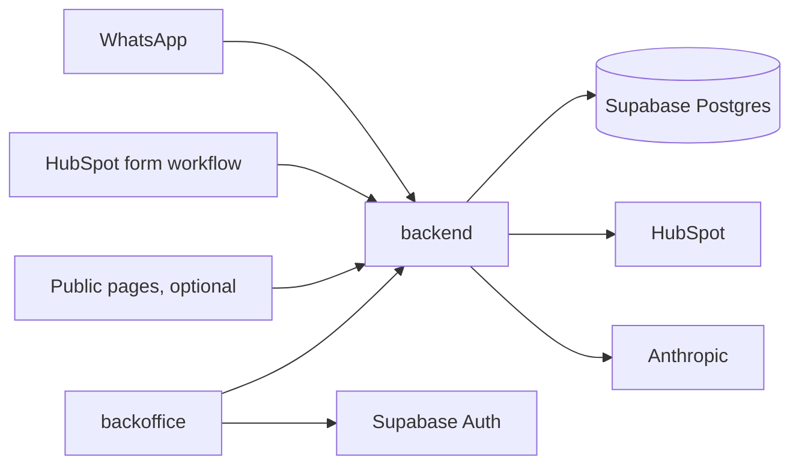
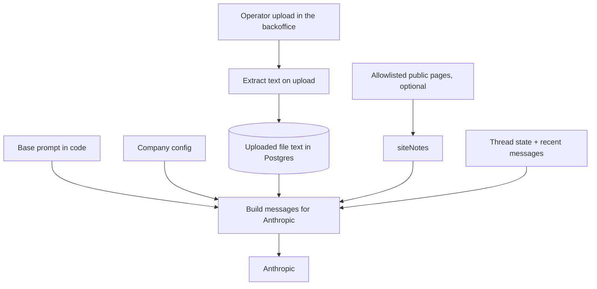

# Design — WhatsApp lead assistant (v1, first client: Altamira Uruguay)

Internal design for Luis. The commercial contract with Altamira is the HTML proposal. This file is how we build it.

**Status:** Altamira accepted. Kickoff is on and implementation has started. Live HubSpot, production WhatsApp, and their Anthropic key are still week-1 access; until then the apps run on env examples and fakes. v1 knowledge is files operators upload in the backoffice. Google Drive / Sheets sync is later.

## Goal

Qualify WhatsApp leads, answer the questions that repeat, and hand a clean summary to a human advisor in the CRM. The assistant does not book visits, does not quote future rental yields, and does not replace the sales team.

Altamira Uruguay is the first client. Volume they reported: about 15–20 leads/day and ~60 conversations/day. About 70% write outside office hours.

**Product goal:** the same system should later be sold to other companies with the same problem (real-estate developers first). Version 1 ships only what Altamira needs, but the code is built as a multi-company product from day one. See [Multi-company](#multi-company).

## Repo layout

One repo, two apps. No Turborepo.

```
backend/      TypeScript HTTP service (Express). WhatsApp webhook, conversation engine, CRM, knowledge uploads.
backoffice/   Next.js (client-side), shadcn new-york, Tailwind, React Query. Thread list and pause.
docs/         Proposal, meeting notes, this design.
```

The backoffice calls the backend over HTTP. It does not talk to Postgres. Shared types can live in a small `shared/` folder later if duplication becomes painful; do not add that on day one.

Backend source layout:

```
backend/src/
  engine/                     conversation states, prompt building, guardrails
  controllers/                one Express router per resource (webhook, form lead, threads, knowledge)
  services/                   one service per resource; each takes a Prisma client and queries directly
  integrations/
    whatsapp/                 Meta Cloud API: webhook parsing, send text, send template
    crm/hubspot/              first CRM adapter
    knowledge/                text extraction from uploaded files; optional allowlisted page fetcher
  llm/                        complete() wrapper around Anthropic
  companies/                  company config, secrets, and the development seed
  routes/                     operator auth
  jobs/                       scheduled jobs (optional site-note fetch)
```

The engine never imports HubSpot, Google, or Meta directly. It talks to small interfaces (`Crm`, `KnowledgeSource`, `Channel`). Adding a second CRM means a new adapter folder, not a rewrite.

## Stack

| Layer | Choice | Why |
| --- | --- | --- |
| Language | TypeScript | Same language in both apps. |
| Backend | Express on Node, deployed as a Docker image | Familiar HTTP server. A small always-on container so the webhook and LLM call are not cut off. |
| Backoffice | Next.js + shadcn + Tailwind + React Query, client-first | UI and routing only. No SSR requirement: pages are client components, data via React Query against the backend. |
| Database | Supabase Postgres | Managed Postgres. |
| ORM | Prisma | Schema and all queries from the backend. Runtime uses the Supabase pooled connection; migrations use the direct connection. |
| Auth | Supabase Auth (browser client in the backoffice) | Email login for operators. Public signup off; Luis creates accounts. The backoffice sends the Supabase JWT to the backend; the backend verifies it and resolves the operator’s company. |
| LLM | Anthropic (`claude-haiku-4-5` to start) | Already agreed with Altamira. Each company uses its own API key. One `complete()` wrapper so a later provider swap is one file. No fine-tune. No multi-provider framework. |
| WhatsApp | Meta Cloud API | Official API number per company. |
| CRM | HubSpot API (first adapter) | Direct API. No Zapier / Make / n8n. No HubSpot native AI. |
| Knowledge | Files operators upload in the backoffice | PDF, DOCX, Markdown, plain text, CSV, and the other usual office formats (XLSX, etc.). Text is extracted on upload, stored per company, and injected into the prompt. Optional allowlisted public pages for stable facts only. No RAG. Google Drive / Sheets is later. |

## Architecture



1. Meta posts an inbound message to the backend webhook. The backend finds the company from the WhatsApp `phone_number_id`, stores the message, and returns 200 right away.
2. Processing happens after the response. Messages for one thread are handled one at a time, and a short wait (a few seconds) groups messages a lead sends in a row into one reply.
3. When a reply is needed, the engine loads the company config and the extracted text of that company’s uploaded files, builds the system prompt + knowledge block + recent messages, and calls Anthropic.
4. The model returns structured output: the reply text plus any extracted fields (see [Conversation](#conversation)). The engine updates the thread state from those fields, runs the guardrails, then sends the reply.
5. On handoff or close, the engine upserts the CRM contact and writes the transcript.
6. Operators open the backoffice, sign in with Supabase Auth, and call the backend (with the JWT) to list their company’s threads, pause one, or upload, replace, and delete knowledge files.

## Multi-company

### Deployment model

One shared deployment for all companies. Every company-owned row has a `companyId`. Every query filters by it.

- With only Altamira, this behaves like a single-client build.
- A new client is a new `Company` row, its config, its secrets, and its WhatsApp number pointed at the same webhook. No new server or database.
- Fallback: if a client ever requires its own isolated database, deploy the same Docker image a second time with its own environment. Same code, no fork.

### What lives in company config (not in code)

- Display name and brand voice notes.
- Language and tone (for Altamira: Uruguayan Spanish with “vos”).
- The qualifying questions.
- Forbidden topics (for Altamira: future rental yield, guaranteed returns).
- Knowledge: files uploaded for that company. Optional allowlisted URLs for secondary site notes. Size limits: 80 KB of extracted text per file and 200 KB per company, plus a 1 MB cap on the original upload.
- CRM adapter type and property names.
- WhatsApp phone number id and template names.
- Business hours, used when offering a call time.

### Secrets per company

Anthropic key, HubSpot token, and Meta access token are per company. They are encrypted on the Company row with AES-256-GCM. The encryption key lives only in the server environment. Platform secrets (database URLs, encryption key, Supabase URL and keys, Meta app secret, webhook verify token) stay in environment variables. No Vault in v1. Google access is not a v1 secret. Drive / Sheets sync and a Connect Google OAuth flow are later. MCP is not the plan.

### Not in v1

Self-signup, billing, a company admin screen, and onboarding wizards. Luis sets up each new company by hand (seed script or SQL).

## Knowledge

No RAG. No embeddings. No live website browsing during a chat. The v1 source is files operators upload in the backoffice, per company. Text is extracted on upload, stored in Postgres, and pasted into the LLM prompt when the bot answers.

Supported formats: PDF, DOCX, Markdown, plain text, CSV, and the other usual office formats (XLSX, etc.).

Extracted text is capped so it fits the prompt. The defaults, stored on the company config, are **80 KB per file** (`knowledge.maxFileBytes` = 81920) and **200 KB per company** (`knowledge.maxCompanyBytes` = 204800). The original upload is capped at **1 MB** (`KNOWLEDGE_MAX_UPLOAD_BYTES` = 1048576) before extraction.

### How facts reach the chatbot



Four pieces, kept separate on purpose:

1. **Base prompt (in code)** — generic behavior shared by every company: answer only from the knowledge block, one question at a time, hand off when unsure, return the structured fields. Edited by Luis.
2. **Company config** — the company-specific parts filled into that prompt: name, tone, questions, forbidden topics.
3. **Uploaded files** — the commercial source. Price-from, typology, delivery, and orientation come from the extracted text. Re-uploading a file replaces its previous version. If the operator does not re-upload, prices go stale. Full inventory and unit-level availability stay with the advisor and are not dumped in chat.
4. **Allowlisted public pages → `siteNotes`** — optional and secondary. Stable facts only (address, amenities, neighborhood). A scheduled fetch can strip the HTML to plain text. Skip it when no allowlist is set. The bot does not open URLs while chatting.

At reply time the backend:

1. Loads the extracted text of that company’s uploaded files, plus site notes when they exist.
2. Formats them into a short **knowledge block** (structured text, not a vector search).
3. Sends to Anthropic: system prompt (base + company config + knowledge block, cached) and the conversation turns.
4. The model answers only from that. If a fact is not in the block, it says it does not know and offers the advisor.

Google Drive / Sheets sync, and a Connect Google OAuth flow, are later. MCP is not the plan. Still no RAG.

Conflict rules:

1. Price, typology, delivery, orientation, and availability → the uploaded files win over `siteNotes`.
2. If a fact is missing from both → the bot says it does not know and offers the advisor.
3. Never answer a forbidden topic (for Altamira: future rental yield or guaranteed returns).
4. Never crawl or fetch a URL while answering a lead.

## Conversation

The model writes the reply and extracts data. The engine owns the state.

### Structured output

Every model call returns, through Anthropic tool use:

- `reply` — the text to send.
- `interest`, `budget`, `knowsProjects` — filled when the lead says them.
- `callTime` — when the lead agrees to a call.
- `intent` — one of `continue`, `qualified`, `not_interested`, `needs_human`.

The engine moves the state from those fields. The model never sets the state directly.

### States

1. **Greeting** — welcome, then move into the questions.
2. **Qualify** — ask the company’s questions (Altamira: interest, budget, whether they know the projects).
3. **Answer** — reply to repeated questions from the knowledge block. Stay here while they ask.
4. **Handoff** — ask when an advisor can call. Once a call time is captured, write the CRM and stop replying.
5. **Closed** — no interest; write the CRM, do not assign an advisor.

**Paused** is a separate flag, not a state. A human pauses the thread from the backoffice; inbound messages are stored but not answered. Resume returns to the state it had.

### Rules

- Inbound text is stored as-is.
- A non-text message (voice, image, sticker) gets one reply asking the lead to type. No transcription in v1.
- Duplicate webhook deliveries are ignored by WhatsApp `message.id` uniqueness.
- A lead who writes on the API number gets the greeting.
- A lead who fills a form gets one approved welcome template, then the same flow. A HubSpot workflow calls `POST /hooks/crm/form-lead` with the contact’s phone; the backend sends the template. The company pays Meta for that send.
- WhatsApp only allows free-form replies within 24 hours of the lead’s last message. Outside that window, only approved templates can be sent. v1 does not send follow-ups after that window.
- Leave **Qualify** only after `interest`, `budget`, and `knowsProjects` are stored. `knowsProjects` may be false. There is no numeric budget minimum in code. `intent` `not_interested` closes the thread even if a question is still open. `intent` `qualified` without the three stored answers does not leave Qualify.
- A lead who writes again after **Closed** or **Handoff** reopens the same thread in **Answer**. The thread keeps its history. If that same turn is the one that first completes the three answers and `callTime`, it still finishes the handoff and writes the CRM.
- Advisors keep their own personal WhatsApp numbers. The bot never lives on those phones.

### Guardrails

- A final check on every reply before sending: if it mentions a forbidden topic (for Altamira, rental yield or guaranteed returns), replace it with a safe fixed message and offer the advisor.
- If Anthropic fails or times out, send a short fixed message (“te va a contactar un asesor”) and mark the thread `needs_human`.
- Cap reply length. WhatsApp messages stay short.

## CRM (HubSpot first)

On handoff or close:

1. Upsert the contact by phone, normalized to E.164 so a form contact and a WhatsApp contact match.
2. Write a long text property with: interest, budget, whether they know the projects, agreed call time (if any), and the full transcript.
3. Do not use HubSpot’s native AI module.

How the advisor is notified (owner, task, or both) and the exact property names are decided at kickoff once Luis has HubSpot access.

## Data model (Prisma sketch)

Names can move when the schema is created. Every table below except `Company` has `companyId`.

- **Company** — name, config (JSON), encrypted secrets, WhatsApp phone number id, createdAt.
- **Operator** — Supabase Auth user id, companyId, email. Maps a login to a company.
- **KnowledgeFile** — companyId, filename, format, extracted text, size, created and replaced timestamps. Re-uploading a file replaces its previous version. Commercial facts (price-from, typology, delivery, orientation) live in that text. Extracted text is limited to 80 KB per file and 200 KB per company. Optional site notes from an allowlist stay secondary and are not this table.
- **Thread** — lead phone (E.164), state, `paused`, `needsHuman`, extracted fields (interest, budget, knowsProjects, callTime), optional email from a form, CRM contact id, last inbound at (for the 24-hour window), created/updated. Unique on (companyId, phone).
- **Message** — thread id, direction (`in` / `out`), body, content type (`text` or the WhatsApp type), WhatsApp message id (unique, nullable for outbound until sent), createdAt.
- **LlmUsage** — thread id, model, input/output tokens, createdAt. Used to see cost per company.

## Backend surface

Rough routes (names can change):

- `GET/POST /webhooks/whatsapp` — Meta verification and inbound events. Company resolved from `phone_number_id`. Verified with Meta’s signature.
- `POST /hooks/crm/form-lead` — form-lead trigger from the company’s CRM workflow. Verified with a per-company shared secret.
- `GET/POST /internal/knowledge/files`, replace, and delete — list, upload, replace, and delete knowledge files for the operator’s company. Upload extracts text and stores it. Replace swaps that file’s previous version.
- `GET /internal/threads` — list the operator’s company threads.
- `GET /internal/threads/:id` — thread + messages.
- `POST /internal/threads/:id/pause` and `.../resume`.

Auth: Supabase JWT on `/internal/*`, mapped to `Operator.companyId`. CORS allows only the backoffice origin.

LLM: one module, `backend/src/llm/complete.ts`, that takes system + messages + the output schema and returns the parsed fields. Prompt building lives in `engine/`, not inside the model call.

## Backoffice (v1)

Client-side Next.js. Use the App Router for file-based routing and shadcn setup, but do not rely on SSR or Server Components for data. Pages are client components; React Query talks to the Express backend. Supabase Auth runs in the browser (`@supabase/supabase-js`); the access token is sent as `Authorization: Bearer …` on backend calls.

Pages:

1. Login (Supabase email). No public signup.
2. Thread list (newest activity first). Show phone, state, paused, last message preview.
3. Thread detail — full messages, pause / resume. If the bot set `needsHuman`, the operator can clear that flag. The panel still does not send WhatsApp.
4. Conocimiento — upload, list, replace, and delete files for the operator’s company. Not a “sync sheet now” button.

The panel does not send messages. Advisors answer from their own WhatsApp.

One shared backoffice for all companies: one Vercel app, one URL. The operator’s company comes from their login (`Operator.companyId`), and the backend filters every request by it. No per-company subdomain, branding, or company switcher in v1. Later options on the same app: a subdomain per client, per-company branding, and a platform admin role for Luis to view all companies.

React Query with polling (for example every 10–15 seconds on the list) is enough at this volume. No realtime subscription in v1.

Shadcn defaults are fine to ship first. Per-company branding is not in v1.

## Hosting, environments, and operations

- **Region:** Supabase (Postgres and Auth) and the backend host are **us-east-1** (N. Virginia). Change this only if Altamira’s contract requires LatAm hosting. Do not create the Supabase project in another region.
- **Backoffice:** Vercel.
- **Backend:** Docker image of the Express app, running as one always-on container (Fly.io, Railway, Render, or similar). Supabase Edge Functions are not the app runtime. Supabase stays Postgres and Auth. The host account is still open; the image is the artifact.
- **Single instance:** scheduled jobs run inside the container (optional site-note fetch only). Sheet sync is not a v1 job. Keep one instance until jobs move to a proper queue.
- **Environments:** staging and production, each with its own database and a test WhatsApp number in staging. Prompt changes go to staging first.
- **Platform secrets (env only, never committed):** database URLs (pooled + direct), Supabase URL and keys, secrets encryption key, Meta app secret and webhook verify token. A Google service account is later, with Drive / Sheets, not v1.
- **Monitoring:** structured logs, error alerts (Sentry or similar), and `LlmUsage` for cost per company.
- **Testing:** a set of real conversations (from Altamira’s WhatsApp Web access) replayed against the prompt after each change. This complements live tuning; it does not replace it.

## Privacy

- Conversations contain personal data. Follow Uruguay’s data protection law (Ley 18.331).
- Do not log message bodies or phone numbers in plain text in application logs.
- Support deleting a lead’s thread and messages on request.
- Outbound templates only go to leads who gave their phone in a form or wrote first.

## Out of scope (v1)

Instagram DM, Messenger, email-to-WhatsApp, landing-form automation beyond the one welcome template, mass email / remarketing, Costa Rica (“Erika”), Calendly, native HubSpot AI, voice-note transcription, sending the project PDF presentation, follow-ups outside the 24-hour window, CRMs other than HubSpot, and anything billed as a future version.

Also not in v1: resale features (self-signup, billing, company admin, onboarding). The architecture is ready for more companies; the product features come later.

Google Drive / Sheets sync and a Connect Google OAuth flow are later, not v1. MCP is not the plan.

## Build order

1. Repo skeleton: `backend/` and `backoffice/`, Prisma schema with `Company`, Supabase Auth, staging deploy.
2. Altamira `Company` row and config; knowledge file upload (extract text, store per company); Conocimiento page to upload, list, replace, and delete.
3. WhatsApp webhook: resolve company, store messages, answer fast, per-thread processing, greeting.
4. Engine with structured output: questions, answers from the knowledge block, guardrails, fallback.
5. Handoff / close → HubSpot upsert + transcript.
6. Backoffice thread list, detail, pause / resume.
7. Form-lead trigger and welcome template.
8. Optional allowlisted site notes into `siteNotes` (secondary; skip if there is no allowlist).
9. Logging, alerts, usage tracking, replay test set.
10. Live prompt tuning after go-live (ongoing; not a setup checkbox).

## Open at kickoff

- Google sheet columns are later. Knowledge size limits are set: 80 KB of extracted text per file, 200 KB per company, 1 MB original upload.
- HubSpot property names, and how advisors are notified (owner, task, or both).
- HubSpot workflow for the form-lead trigger.
- WhatsApp number, Meta Business access and verification, welcome template approval.
- Allowlist of public URLs for site notes.
- Hosting account for the backend.
- Software ownership with Altamira in the signed contract (needed for resale).
- Partnership terms with José Daniel and Luis’s father, if the product is sold together.
